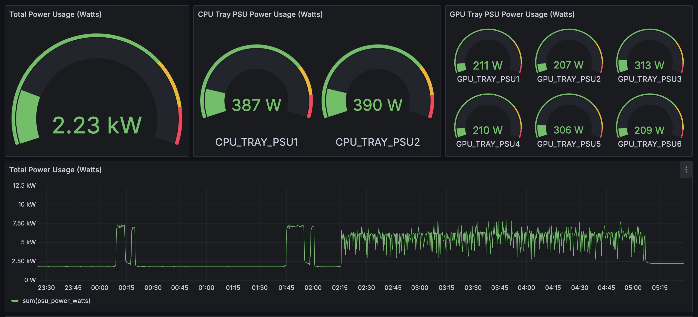
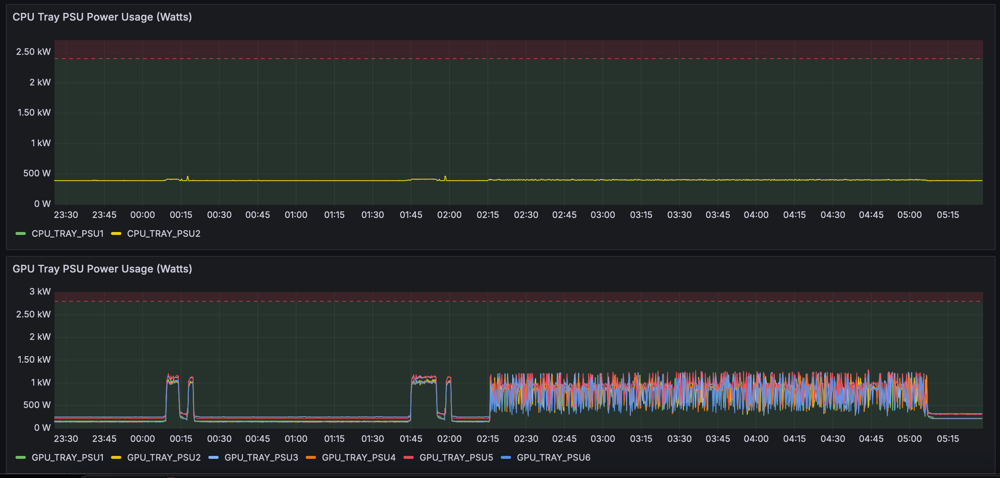
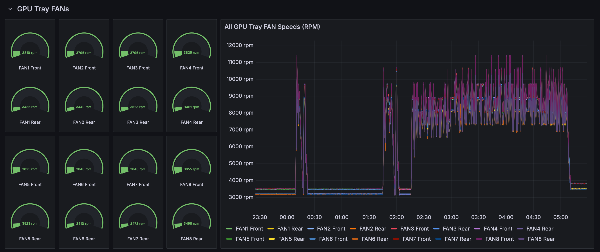
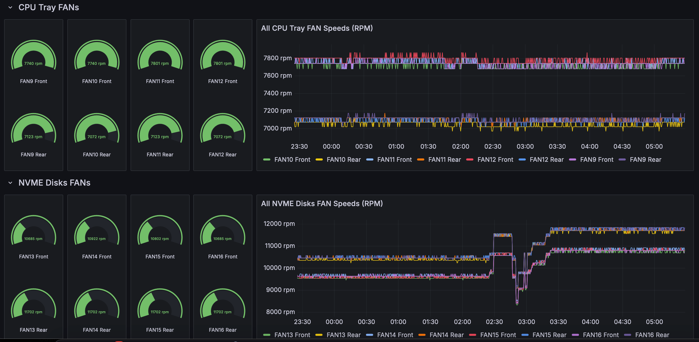
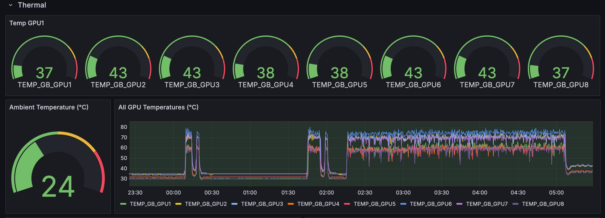

# Prometheus Exporter for Cisco UCS C885A

## Abstract

This Prometheus exporter is designed to collect and expose hardware metrics from a Cisco UCS C885A server using Redfish APIs. It gathers data on PSU power consumption, fan speeds, and temperatures, making these metrics available for monitoring and visualization through Prometheus and Grafana.

## Installation

### Prerequisites

- **Python 3.10 or later**: Ensure you have Python 3.10 or later installed on your system.
- **Redfish API Access**: Ensure you have network access to the Cisco UCS server's Redfish API and appropriate credentials.

### Preferred Installation Method (Setup Script)

We recommend using the provided setup script for a streamlined installation and configuration process. This method automatically handles environment setup, service installation, and starting the exporter.

#### Steps

1. **Clone the Repository**

    ```
    git clone https://github.com/rtortori/prometheus-exporter-ucs-c885a.git
    cd prometheus-exporter-ucs-c885a
    ```

2. **Run the Setup Script**

    ```
    chmod +x ./setup_exporter.sh
    ./setup_script.sh
    ```

    - The script will prompt you for necessary information such as BMC IP, username, and password
    - It will create a virtual environment, install dependencies, configure the exporter as a systemd service, and start the service
    - Ensure the BMC_PASSWORD environment variable is set during setup or manually in your shell profile


### Manual Installation (Alternative)

For those who prefer manual setup, follow these steps:

#### Steps

1. **Set Up a Virtual Environment**

    ```
    python3 -m venv .venv
    source .venv/bin/activate
    ```

2. **Install Dependencies**

    ```
    pip install -r requirements.txt
    ```

3. **Run the Exporter**

    Exporter help:

    ```
    % python c885a_prometheus_exporter.py -h
    usage: c885a_prometheus_exporter.py [-h] --bmc-ip BMC_IP --bmc-username BMC_USERNAME --exporter-port EXPORTER_PORT [--log-level LOG_LEVEL]

    Collect stats from the server.

    options:
    -h, --help            show this help message and exit
    --bmc-ip BMC_IP       Server BMC IP address
    --bmc-username BMC_USERNAME
                            Username for authentication
    --exporter-port EXPORTER_PORT
                            Port for the Prometheus exporter to listen on
    --log-level LOG_LEVEL
                            Logging level (default: DEBUG)
    ```

    Set BMC_PASSWORD as an environment variable:

    ```
    export BMC_PASSWORD=my_password
    ```

    Run:

    ```
    python c885a_prometheus_exporter.py --bmc-ip <BMC_IP> --bmc-username <BMC_USERNAME> --exporter-port <EXPORTER_PORT>
    ```


### Uninstall the Exporter (if installed with the setup script)

```
chmod +x ./uninstall_exporter.sh
./uninstall_exporter.sh
```

### Usage

#### Integrating with Prometheus.

Add the following configuration to your `prometheus.yml` file to scrape metrics from this exporter:

```
scrape_configs:
  - job_name: 'c885a_exporter'
    static_configs:
      - targets: ['localhost:<EXPORTER_PORT>']
```

#### Viewing Metrics

- The exporter runs a Flask server that exposes metrics at `http://<YOUR_SERVER_IP>:<EXPORTER_PORT>/metrics`.
- You can use a web browser or a tool like curl to view the raw metrics.


#### Grafana Dashboard

This repo provides an out-of-the-box Grafana dashboard to visualize all metrics collected.

- Create a new dashboard 
- Select import and use the `Cisco UCS C885A-1731570520382.json` file

##### Examples











### Contributions

Contributions are welcome! Please open an issue or submit a pull request on GitHub.